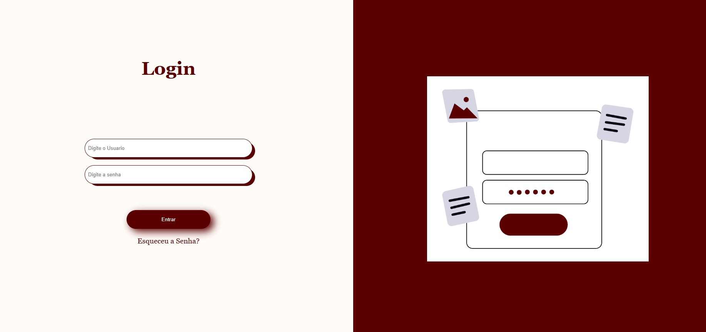

# 🔑 Tela de Login Responsiva

Este projeto é uma **página de login estilizada com HTML e CSS**, desenvolvida para treinar **layout com Flexbox**, **estilização com Box Model** e aplicação de **cores e sombras**.  
O design é simples, elegante e responsivo, contando com uma seção de login e uma seção ilustrativa.

---

## 📸 Preview



---

## 📂 Estrutura do Projeto

```

📁 projeto-login
┣ 📜 index.html        # Estrutura da página
┣ 🎨 style.css         # Estilização da página
┣ 🖼 undraw\_enter-password\_1kl4.png   # Ilustração usada no layout

````

---

## 🎨 Layout

- **Divisão em duas colunas** (50% login e 50% banner).
- **Formulário centralizado** com campos de:
  - Usuário 👤
  - Senha 🔒
  - Botão estilizado "Entrar"
  - Link "Esqueceu a senha?"
- **Imagem ilustrativa** ao lado do formulário.

---

## 🚀 Tecnologias Utilizadas

- **HTML5**
- **CSS3 (Flexbox, Box Model e sombras)**

---

## 🖌 Paleta de Cores

- Fundo principal: `#ffffff`
- Destaques e botões: `#590000` (bordô)
- Fundo do formulário: `#fffdf8`

---

## 📚 Aprendizados

Neste projeto foram praticados:
- Estruturação semântica de formulário em HTML.
- Uso do **Flexbox** para criar layouts responsivos.
- Estilização de inputs e botões com **bordas arredondadas** e **sombras**.
- Integração de imagem para compor a interface.

---

## ⚡ Como Executar

1. Baixe ou clone este repositório:
   ```bash
   git clone https://github.com/seu-usuario/projeto-login.git
````

2. Abra o arquivo `index.html` em qualquer navegador.
3. Pronto! 🎉

---

## 💡 Possíveis Melhorias

* Validação dos campos com **JavaScript**.
* Tornar a página **totalmente responsiva para mobile**.
---

## 👨‍💻 Autor

Desenvolvido por **\Profº Alessandro** ✨

```


